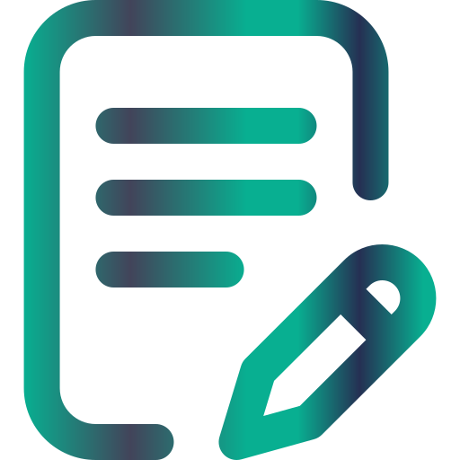
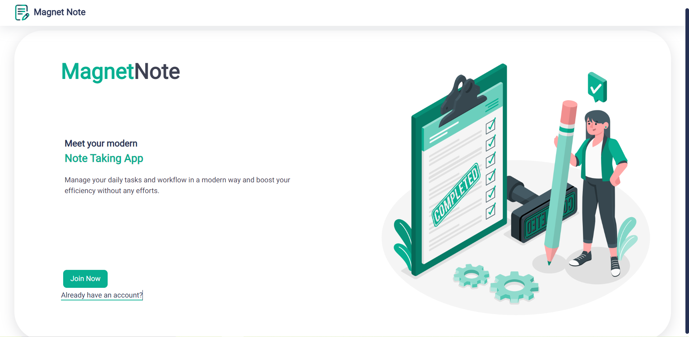
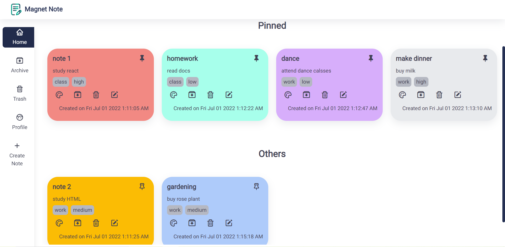

<div align="center">
  

# [Magnet Note](https://magnet-note.netlify.app/)

Magnet Note is an easy to use, minimalistic note-taking app which would really help in improving your daily productivity as well as inculcate a habit of writing down various resources such as study resources, groceries, and day to day tasks.

</div>

---

## How to run the app locally?

```
$ git clone https://github.com/KanekarSnehal/Magnet-Note.git
$ cd Magnet-Note
$ npm install
$ npm start
```

---

## Deployed Link

Checkout the live demo [here](https://magnet-note.netlify.app/)

---

## Tech Stack and Tools

- React JS
- React Router v6
- React Context API + useReducer
- MagnetUI Component Library
- Netlify for Deployment

---

## Features

- Landing page
- Notes
  - User can create a note with title and description
  - Note description has Rich Text Editor
  - User can choose a background color for note
  - User can add labels to note
  - User can archieve a note
  - User can trash a note
- Home page with filtering options
  - User can filter notes by latest, oldest, priority and tags
- Archive page
  - User can view his/her archieved notes
- Trash Page
  - User can view his/her trash notes
- User Authentication - Signup and Login pages

## Screens


<br/>

